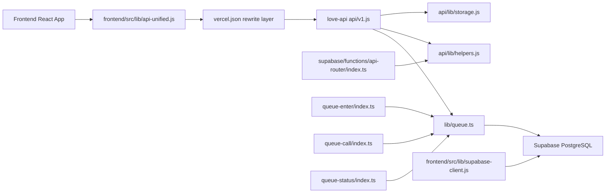

# Combined Architecture

```mermaid
flowchart LR
BROWSER[Frontend React App] --> APIU[frontend/src/lib/api-unified.js]
APIU --> VERCEL[vercel.json rewrite layer]
VERCEL --> BACKEND[love-api api/v1.js]
BACKEND --> QUEUE[lib/queue.ts]
BACKEND --> HELPERS[api/lib/helpers.js]
BACKEND --> STORAGE[api/lib/storage.js]
QUEUE --> DB[Supabase PostgreSQL]
SUPA[frontend/src/lib/supabase-client.js] --> DB
ROUTER[supabase/functions/api-router/index.ts] --> HELPERS
QUEUE_ENTER[queue-enter/index.ts] --> QUEUE
QUEUE_CALL[queue-call/index.ts] --> QUEUE
QUEUE_STATUS[queue-status/index.ts] --> QUEUE
```
