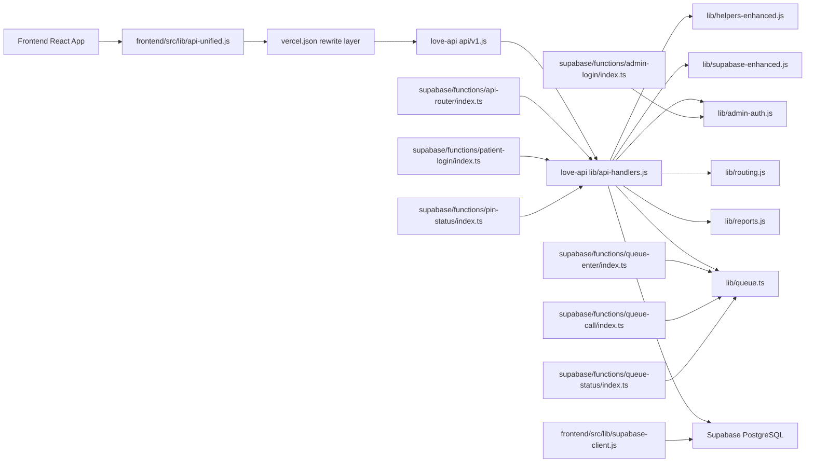

# Combined Architecture

## Verified runtime path
- Frontend routes and client workflow calls originate in `frontend/src/App.jsx` and `frontend/src/lib/api-unified.js`.
- Backend canonical HTTP entry is `love-api/api/v1.js`, which delegates to `love-api/lib/api-handlers.js`.
- Queue Edge Functions are compatibility wrappers over the canonical queue domain.
