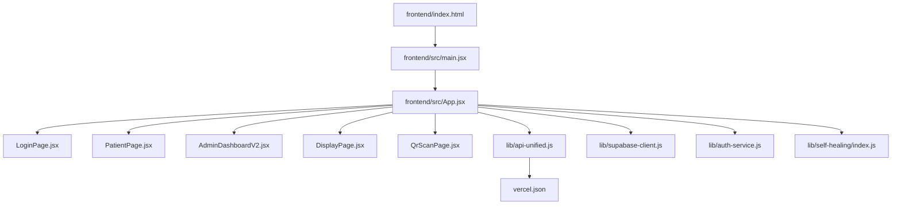

# Frontend Architecture

```mermaid
flowchart TB
HTML[frontend/index.html] --> MAIN[frontend/src/main.jsx]
MAIN --> APP[frontend/src/App.jsx]
APP --> LOGIN[LoginPage.jsx]
APP --> PATIENT[PatientPage.jsx]
APP --> ADMIN[AdminDashboardV2.jsx]
APP --> DISPLAY[DisplayPage.jsx]
APP --> QR[QrScanPage.jsx]
APP --> API[lib/api-unified.js]
APP --> SUPA[lib/supabase-client.js]
APP --> AUTH[lib/auth-service.js]
APP --> SH[lib/self-healing/index.js]
API --> VERCEL[vercel.json]
```
