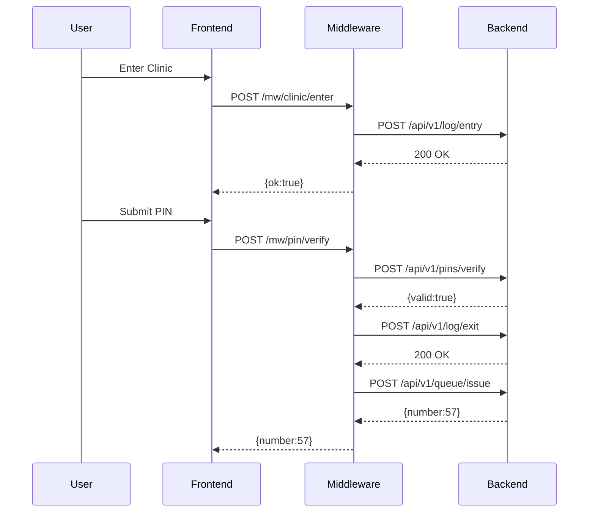

```mermaid
sequenceDiagram
  participant U as User
  participant F as Frontend
  participant M as Middleware
  participant B as Backend

  U->>F: Enter Clinic
  F->>M: POST /mw/clinic/enter
  M->>B: POST /api/v1/log/entry
  B-->>M: 200 OK
  M-->>F: {ok:true}

  U->>F: Submit PIN
  F->>M: POST /mw/pin/verify
  M->>B: POST /api/v1/pins/verify
  B-->>M: {valid:true}
  M->>B: POST /api/v1/log/exit
  B-->>M: 200 OK
  M->>B: POST /api/v1/queue/issue
  B-->>M: {number:57}
  M-->>F: {number:57}
```
